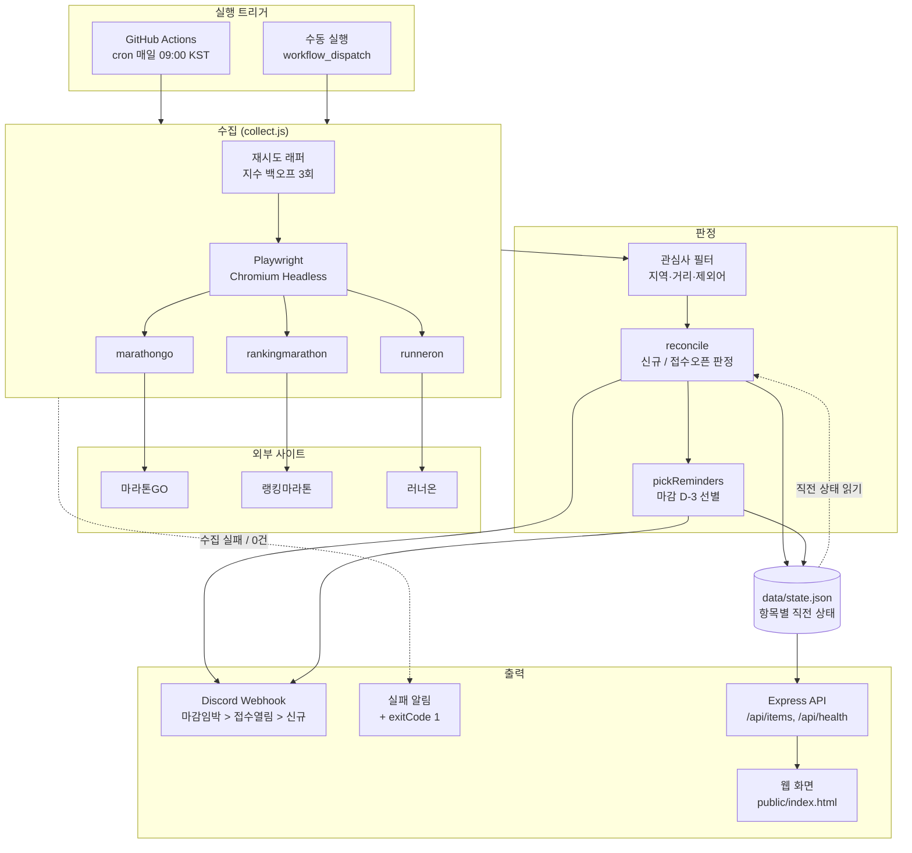
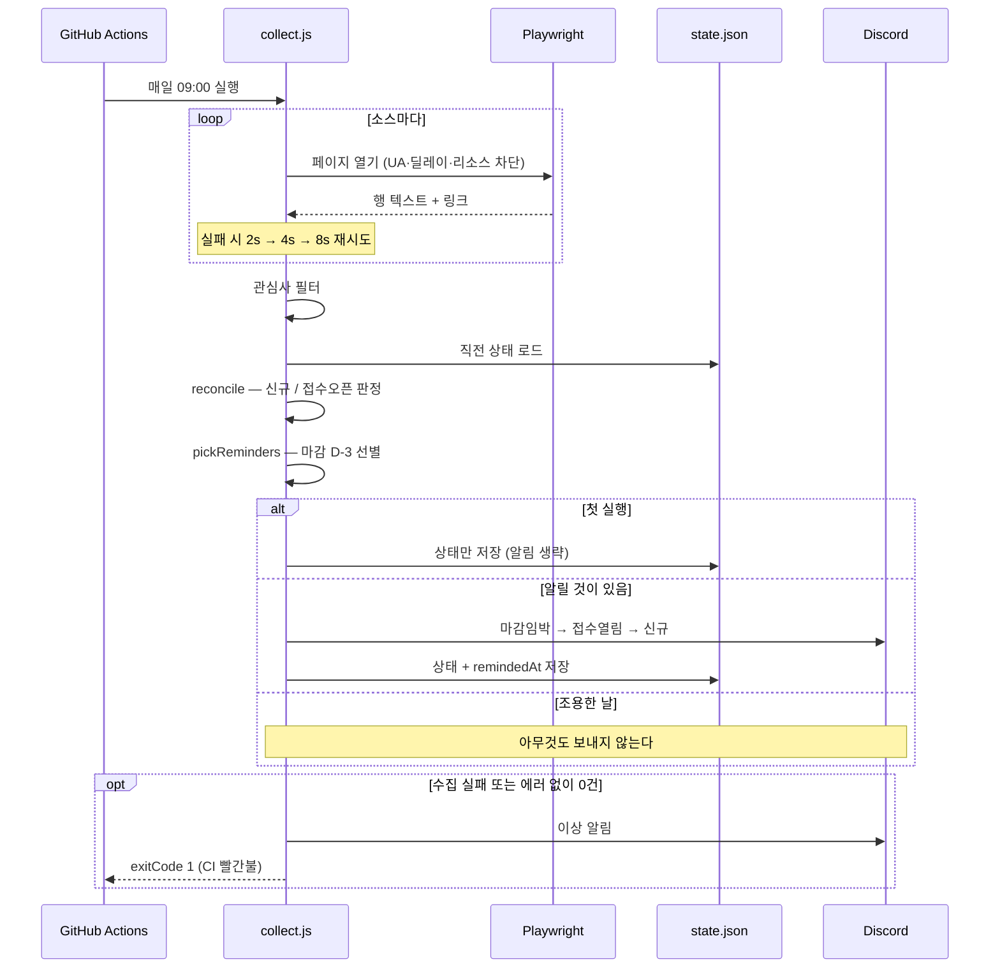

# run-alert

마라톤 대회 일정을 매일 수집해서 **접수 마감 임박 · 접수 오픈 · 신규 대회**를 알려주는 자동화.

> 개발 환경: Node.js 22 · Playwright 1.56 · Express 4
> 설치와 배포는 [포팅 매뉴얼](docs/PORTING.md) 참고

---

## 1. 문제 정의

마라톤 대회는 주최가 제각각이라 일정이 여러 사이트에 흩어져 있다.
그런데 **정보를 못 찾는 게 진짜 문제가 아니다.** 선착순 마감 대회가 많아서,
실제로 못 나가는 경로는 이 두 가지다.

| 놓치는 경로 | 필요한 것 |
|---|---|
| 접수가 열린 걸 몰랐다 | 상태가 `접수중`으로 바뀌는 순간을 잡아 알린다 |
| 알림은 봤는데 나중에 하지 하다가 까먹었다 | 마감 직전에 한 번 더 찌른다 |

그래서 이 프로젝트의 목표는 "대회 목록 모으기"가 아니라
**"내가 신청할 수 있었는데 놓치는 일을 없애기"** 로 잡았다.

---

## 2. 시스템 아키텍처



**핵심은 가운데 `state.json`이다.** 수집기는 매번 "현재 목록"만 알 수 있고,
"무엇이 달라졌는지"는 모른다. 직전 상태를 남겨두고 비교해야 변화가 나온다.

### 데이터 모델

```jsonc
// data/state.json
{
  "items": {
    "a1b2c3d4e5f6": {              // 키 = 상세 링크의 sha1 앞 12자
      "type": "race",
      "source": "marathongo",
      "title": "빵트레일런 2026",
      "date": "2026-09-12",         // 대회일
      "region": "강원",
      "distances": ["10km", "30K", "20K"],
      "status": "접수중",            // ← 이 값의 변화를 감시한다
      "regOpen": "2026.03.31",
      "regClose": "2026.09.12",     // ← 마감 임박 판정 기준
      "firstSeen": "2026-09-09",
      "lastSeen": "2026-09-09",
      "remindedAt": "2026-09-09"    // 쿨다운용
    }
  }
}
```

키를 제목이 아니라 **상세 링크 해시**로 잡았다. 주최측이 대회명을
"제6회 …" → "2026 …" 처럼 바꿔도 같은 대회로 인식해야 하기 때문이다.

### 실행 흐름



---

## 3. 설계 결정과 근거

각 항목은 **문제 → 선택 → 근거 → 트레이드오프** 순이다.

### 3.1 "신규 항목"만 비교하면 정작 필요한 이벤트를 놓친다

처음에는 이전 수집분에 없던 항목만 골라 알렸다. 그런데 실제로 필요한 건
**이미 알고 있던 대회의 접수가 열리는 순간**이다. 그건 새 항목이 아니라
기존 항목의 **상태 변화**라서 신규 비교로는 구조적으로 절대 안 잡힌다.

- **선택**: 항목별 직전 상태를 저장하고 `접수예정 → 접수중` 전이를 감지 (`reconcile`)
- **트레이드오프**: 상태 파일을 계속 들고 다녀야 한다. 항목이 수천 건을 넘으면 SQLite로 옮겨야 한다

### 3.2 알림 순서는 급한 순서

아침에 폰을 보는 3초 안에 "지금 뭘 해야 하는지"가 보여야 한다.

1. **접수 마감 임박** — 지금 안 하면 못 나간다
2. **접수 열림** — 오늘 신청할 수 있다
3. **새로 올라온 대회** — 알아두면 되는 정보

- **근거**: 놓치는 실제 경로가 "몰라서"가 아니라 "미루다가"이므로, 마감 직전 리마인드가 가장 값이 크다
- **선택**: 마감 D-3 이내 + 접수중 + 대회일 미경과 + 쿨다운 2일 경과 → 리마인드
- **트레이드오프**: 쿨다운을 두면 D-3~D-0 사이에 한두 번만 알린다. 매일 알리는 것보다 놓칠 확률은 조금 오르지만, 알림 피로로 채널 자체를 무시하게 되는 쪽이 더 큰 손해라고 판단했다

### 3.3 조용한 날에는 아무것도 보내지 않는다

매일 "오늘은 새 소식 없음"이 도착하면 사람이 알림을 무시하기 시작하고,
그러면 정작 중요한 날에도 안 본다. **알림이 시끄러워지는 순간 자동화는 죽은 것이다.**

- **트레이드오프**: 시스템이 살아 있는지 알림만으로는 알 수 없다.
  그래서 헬스 신호를 알림이 아니라 **CI 상태와 `/api/health`** 로 분리했다

### 3.4 수집은 넓게, 알림은 좁게

전국 대회를 다 수집해 화면에서는 전부 볼 수 있게 하되, 알림에서는
지난 대회와 접수마감 대회를 뺀다. 할 수 있는 게 없는 정보는 알림이 아니라 소음이다.

### 3.5 긁어도 되는 곳만 긁는다

수집 대상을 고르기 전에 robots.txt를 확인하고 결과를 `src/config.js`에 근거로 남겼다.

| 사이트 | 판단 | 근거 |
|---|---|---|
| 마라톤GO | 사용 | `User-agent: * / Allow: /` |
| 랭킹마라톤 | 사용 (공개 페이지만) | `Allow: /`, `Disallow: /api/` → 내부 API 미호출 |
| 러너온 | 사용 (`/Marathon`만) | `/Marathon` 명시적 Allow, `/api/`·`/marathon/ics` Disallow |
| 무신사 | **제외** | 기본값이 `User-agent: * / Disallow: /` |
| KREAM | **제외** | robots.txt 확인 불가 → 확인이 안 되면 하지 않는다 |

**API나 RSS가 있으면 화면을 긁지 않는다**도 같은 원칙이다.
러닝화 발매 소스(Nike SNKRS, Hypebeast RSS)는 구현해두고 `enabled: false`로 꺼뒀다 —
이번 범위가 아니라서지 못 해서가 아니다.

### 3.6 상대 서버에 부담을 주지 않는다

마라톤 일정 사이트는 대부분 개인이나 소규모로 운영된다. 대기업 사이트처럼 다루면 안 된다.

- 하루 1회 실행, 요청 간 3초 딜레이
- 이미지·폰트·미디어 리소스 차단 — 텍스트만 필요하고 상대 전송량도 준다
- User-Agent에 연락처를 넣어 운영자가 로그를 보고 연락할 수 있게 했다
- 소스당 페이지 상한 — 페이지네이션 사고로 수백 번 요청하는 일을 막는다

### 3.7 셀렉터를 눈으로 찍지 않는다

대상 페이지는 MUI(React)로 그려지고 클래스명이 `css-pwbe9m` 같은 빌드 해시다.
**이걸 셀렉터로 쓰면 상대가 배포 한 번만 해도 깨진다.**

- **선택**: 안 바뀌는 것 — 상세 링크(`a[href*="/raceDetail/"]`) — 를 앵커로 잡고,
  행 텍스트를 정규식으로 파싱한다. 마크업이 바뀌어도 텍스트 형식이 유지되면 살아남는다
- **도구**: `npm run probe -- <source-id>` 로 반복 클래스 조합·링크 샘플·스크린샷을 뽑아
  근거를 남기고 셀렉터를 정한다. 개편돼도 같은 방법으로 다시 찾을 수 있다
- **트레이드오프**: 텍스트 파싱은 대회명에 거리 표기가 섞이면 부정확해진다
  (예: "달리는 세상 10km 런" → "달리는 세상 런"). 알림 식별에는 지장이 없어 감수했다

### 3.8 조용히 죽지 않게 한다

자동화의 진짜 실패는 에러가 나는 게 아니라 **아무 일도 안 하면서 성공한 척하는 것**이다.

| 장치 | 동작 |
|---|---|
| 재시도 | 지수 백오프 3회 (2s → 4s → 8s) |
| 실패 알림 | 3회 모두 실패하면 Discord로 알린다 |
| **셀렉터 드리프트 감지** | **"에러 없이 0건"을 성공이 아니라 이상 신호로 취급** |
| 종료 코드 | 문제가 있으면 `exitCode = 1` → CI 빨간불 |
| 소스별 집계 로그 | 어느 소스가 몇 건 들어와 몇 건 살아남았는지 기록 |
| 구조화 로그 | JSON 한 줄씩 `data/run.log`, 실패해도 아티팩트 업로드 |

드리프트 감지는 이론이 아니다. **첫 CI 실행에서 실제로 이 장치가 문제를 잡아냈다.**
상세 링크 경로를 `/raceSchedule/`로 잘못 추정해 예외 없이 0건이 나왔는데,
이 규칙이 없었다면 "매일 성공하지만 아무것도 안 하는 자동화"가 될 뻔했다.

### 3.9 첫 실행은 시드로 처리한다

첫 수집에서는 239건 전부가 "신규"다. 그대로 알리면 알림 폭탄이 되고,
사용자는 첫날 알림을 꺼버린다.

- **선택**: 저장된 상태가 없으면 상태만 저장하고 알림을 건너뛴다. 두 번째 실행부터가 진짜 변화다

### 3.10 화면도 테스트로 지킨다

알림이 조용히 망가지면 안 되므로 Express API와 웹 화면에 Playwright E2E를 붙이고 CI에서 돌린다.
Playwright를 수집에만 쓰지 않고 원래 용도로도 쓴다.

---

## 4. 프로젝트 구조

```
src/
  config.js            수집 대상, 필터, 알림·리마인드 규칙, 예의·재시도 정책
  collect.js           엔트리포인트: 수집 → 필터 → 판정 → 알림
  server.js            Express API + 정적 화면
  lib/
    browser.js         Playwright 컨텍스트 (UA, 리소스 차단)
    retry.js           지수 백오프
    store.js           상태 저장, 신규/접수오픈 판정, 마감 임박 선별
    notify.js          Discord 알림 (이벤트 / 실패)
    logger.js          JSON 구조화 로그
  sources/
    marathongo.js      Playwright  (구현 완료)
    rankingmarathon.js Playwright  (셀렉터 미확정 — enabled: false)
    runneron.js        Playwright  (셀렉터 미확정 — enabled: false)
    snkrs.js           Playwright  (보류 — enabled: false)
    hypebeast.js       RSS         (보류 — enabled: false)
tools/
  probe.mjs            셀렉터 탐색기
  notify-test.mjs      웹훅 연결 확인
tests/e2e/             화면·API E2E
docs/PORTING.md        포팅 매뉴얼
.github/workflows/     collect (스케줄) / e2e (PR)
```

---

## 5. 개발 방식

기획과 설계 판단(무엇을 만들지, 어떤 알림을 어떤 순서로 보낼지, 어떤 사이트를
수집 대상에 넣고 뺄지)은 직접 정했고, 구현은 Claude를 활용한 바이브 코딩으로 진행했다.
커밋 이력에 공동 작성자로 명시돼 있다.

문제를 발견하고 고친 과정도 커밋 메시지에 남겼다 — 셀렉터 오추정,
첫 실행 알림 폭탄, 한글 경계에서 `\b`가 동작하지 않던 정규식 버그 등.

---

## 6. 알려진 한계

- `rankingmarathon`, `runneron`은 셀렉터가 아직 추정값이라 `enabled: false`로 꺼둔 상태다.
  미구현 소스를 켜두면 매일 CI가 빨갛게 뜨고, 그러면 진짜 고장을 알아채지 못한다 —
  알림 피로와 같은 이유다. `npm run probe`로 확정한 뒤 켠다
- 상태 표기가 사이트마다 다르다 (`접수중` / `접수 중` / `신청중`).
  `config.js`의 `OPEN_STATUS` 정규식으로 흡수하며, 새 표기가 나오면 추가해야 한다
- 대회 연도는 `| 2026 접수마감` 표기에서 읽는다. 표기가 없으면 현재 연도로 가정한다
- 상태를 리포지토리에 커밋해 관리한다. 수천 건을 넘으면 SQLite 등으로 옮겨야 한다
- 실사용자를 대상으로 한다면 알림 채널이 Discord가 아니라 카카오톡·이메일이어야 한다.
  웹훅을 직접 만드는 건 일반 사용자에게 진입장벽이다
